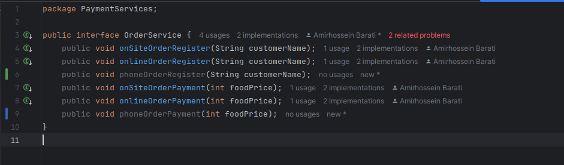
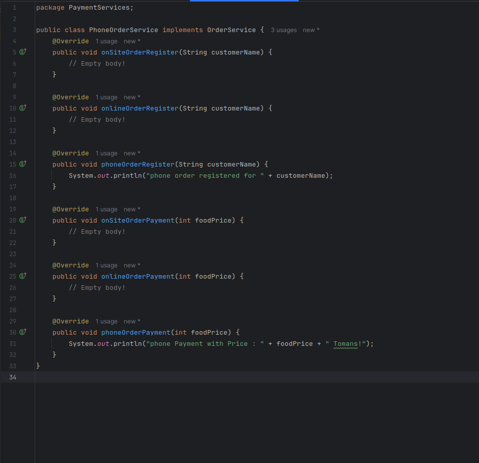

# گزارش کار آزمایش دوم آز نرم افزار
در این آزمایش قصد داریم یک سیستم نرم‌افزاری که از اصول SOLID پیروی نمی‌کند را بررسی کنیم و در صورت نیاز، مجدد آن را با اتکا به این اصول طراحی و بازتولید کنیم. با پیاده‌سازی این اصول، قصد داریم نرم‌افزاری ماژولار، انعطاف‌پذیر و مقاوم‌تری ایجاد کنیم که نه تنها اصلاحات و گسترش‌های آینده را ساده‌تر می‌کند، بلکه خوانایی و قابلیت استفاده مجدد کد را بهبود می‌بخشد و همکاری توسعه‌دهندگان پروژه را مؤثرتر می‌سازد.
## اعضای تیم
- همراز عرفاتی ۹۹۱۰۹۷۹۹
- امیرحسین براتی ۹۹۱۰۱۳۰۸
- امیرحسین عابدی ۹۹۱۰۵۵۹۴
## بخش اول: پیاده‌سازی یک روش پرداخت دیگر
با توجه به دستور کار آزمایش، در این بخش قصد داریم تا یک روش پرداخت تلفنی را به روش‌های پرداخت سیستم اضافه کنیم. برای اینکار با توجه به نحوه پیاده‌سازی سیستم، باید یک کلاس جدید برای این روش پرداخت ایجاد کنیم که از رابط `OrderService` ارث‌بری می‌کند. همچنین باید تغییرات لازم را در این رابط اعمال کنیم تا با توجه به سیستم قبلی بتواند فعالیت خود را ادامه دهد.

### تغییر کلاس OrderService
بنابراین در ابتدا در رابط `OrderService` دو تابع برای ثبت و پرداخت این روش جدید اضافه می‌کنیم:

### پیاده‌سازی کلاس PhoneOrderSerivce

حال با توجه به این تغییرات، کلاس `PhoneOrderService` را به شکل زیر پیاده می‌کنیم. مشاهده می‌کنیم که علاوه‌بر تابع‌هایی که اکنون اضافه کردیم، می‌بایست سایر تابع‌هایی که از قبل برای دیگر روش‌ها در سیستم موجود بودند را هم در کلاس  خود پیاده کنیم.

