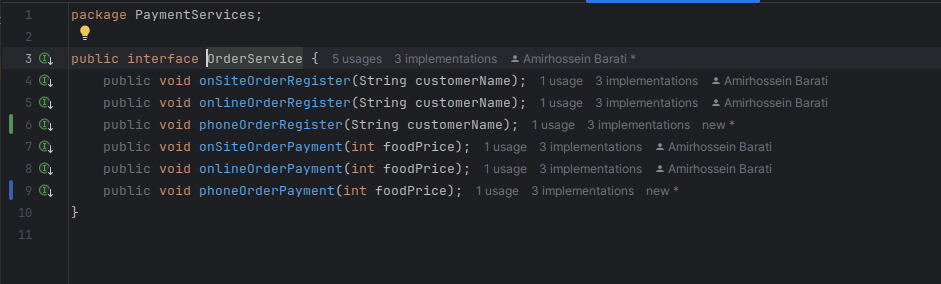

# گزارش کار آزمایش دوم آز نرم افزار
در این آزمایش قصد داریم یک سیستم نرم‌افزاری که از اصول SOLID پیروی نمی‌کند را بررسی کنیم و در صورت نیاز، مجدد آن را با اتکا به این اصول طراحی و بازتولید کنیم. با پیاده‌سازی این اصول، قصد داریم نرم‌افزاری ماژولار، انعطاف‌پذیر و مقاوم‌تری ایجاد کنیم که نه تنها اصلاحات و گسترش‌های آینده را ساده‌تر می‌کند، بلکه خوانایی و قابلیت استفاده مجدد کد را بهبود می‌بخشد و همکاری توسعه‌دهندگان پروژه را مؤثرتر می‌سازد.
## اعضای تیم
- همراز عرفاتی ۹۹۱۰۹۷۹۹
- امیرحسین براتی ۹۹۱۰۱۳۰۸
- امیرحسین عابدی ۹۹۱۰۵۵۹۴
## بخش اول: پیاده‌سازی یک روش پرداخت دیگر
با توجه به دستور کار آزمایش، در این بخش قصد داریم تا یک روش پرداخت تلفنی را به روش‌های پرداخت سیستم اضافه کنیم. برای اینکار با توجه به نحوه پیاده‌سازی سیستم، باید یک کلاس جدید برای این روش پرداخت ایجاد کنیم که از رابط `OrderService` ارث‌بری می‌کند. همچنین باید تغییرات لازم را در این رابط اعمال کنیم تا با توجه به سیستم قبلی بتواند فعالیت خود را ادامه دهد.

### تغییر کلاس OrderService
بنابراین در ابتدا در رابط `OrderService` دو تابع برای ثبت و پرداخت این روش جدید اضافه می‌کنیم:

### پیاده‌سازی کلاس PhoneOrderSerivce

حال با توجه به این تغییرات، کلاس `PhoneOrderService` را به شکل زیر پیاده می‌کنیم. مشاهده می‌کنیم که علاوه‌بر تابع‌هایی که اکنون اضافه کردیم، می‌بایست سایر تابع‌هایی که از قبل برای دیگر روش‌ها در سیستم موجود بودند را هم در کلاس  خود پیاده کنیم:

### اضافه کردن تابع‌های جدید به کلاس‌های OnSiteOrderService و OnlineOrderService

با توجه به اینکه کلاس‌های `OnSiteOrderService` و `OnlineOrderService` از رابط `OrderService` ارث‌بری می‌کنند، بایست تمامی توابع تعریف شده در این رابط را پیاده‌سازی کنند. بنابراین باید پیاده‌سازی دو تابع `phoneOrderRegister` و `phoneOrderPayment` را به این کلاس‌ها اضافه کنیم:

### تغییر کلاس Main برای اضافه کردن سرویس جدید

حال نوبت به این می‌رسد که سرویس جدید را در روند برنامه اضافه کنیم. برای اینکار تغییرات زیر را در تابع `main` اضافه می‌کنیم:

اکنون می‌توانیم در منوی انتخاب روش پرداخت، با انتخاب عدد سه، پرداخت را به صورت تلفنی انجام دهیم. 

جدول تغییرات به صورت زیر است

<table dir='rtl'>
<tbody>
<tr>
<td width="64">

<strong>ردیف</strong>

</td>
<td width="198">

<strong>محل اعمال تغییرات (کلاس/واسط)</strong>

</td>
<td width="141">

<strong>عنوان تغییر</strong>

</td>
<td width="292">

<strong>شرحی کوتاه از تغییر</strong>

</td>
</tr>
<tr>
<td width="64">

<strong>۱</strong>

</td>
<td width="198">

OrderService

</td>
<td width="141">

افزودن تابع برای پشتیبانی از کلاس جدید

</td>
<td width="292">

افزودن دو تابع void با نام phoneOrderRegister و phoneOrderPayment برای پشتیبانی از روش جدید رجیستر و پرداخت

</td>
</tr>

<tr>
<td width="64">

<strong>۲</strong>

</td>
<td width="198">

PhoneOrderService

</td>
<td width="141">

کلاس جدید برای پشتیبانی از خدمات تلفنی

</td>
<td width="292">

افزودن کلاس جدید PhoneOrderService برای پیاده‌سازی دو تابع void با نام‌های phoneOrderPayment و phoneOrderRegister و بدنه‌ تابع‌های دیگر خالی

</td>
</tr>

<tr>
<td width="64">

<strong>۳</strong>

</td>
<td width="198">

OnSiteOrderService

</td>
<td width="141">

افزودن تابع برای رفع خطای کامپایل

</td>
<td width="292">

پیاده‌سازی دو تابع جدید phoneOrderRegister و phoneOrderPayment برای پیروی از اینترفیس OrderService

</td>
</tr>

<tr>
<td width="64">

<strong>۴</strong>

</td>
<td width="198">

OnlineOrderService

</td>
<td width="141">

افزودن تابع برای رفع خطای کامپایل

</td>
<td width="292">

پیاده‌سازی دو تابع جدید phoneOrderRegister و phoneOrderPayment برای پیروی از اینترفیس OrderService

</td>
</tr>

<tr>
<td width="64">

<strong>۵</strong>

</td>
<td width="198">

Main

</td>
<td width="141">

افزودن تابع برای رفع خطای کامپایل

</td>
<td width="292">

اضافه کردن خطوط کد جدید در خطوط ۴۷ تا ۴۹ و ۵۸ تا ۵۹ فایل Main.java برای اضافه کردن روش پرداخت تلفنی جدید

</td>
</tr>

</tbody>
</table>

کل تغییرات: ۵

## بخش دوم: تحلیل و بررسی برنامه از منظر SOLID

موارد نقض شده را در جدول پایین مشاهده می‌کنیم، تمامی موارد بر اساس کد نهایی بخش اول هستند.

<table dir='rtl'>
<tbody>
<tr>
<td rowspan="2" width="240">

اصل 1

Single Responsibility

</td>
<td width="95">

<strong>موارد تحقق</strong>

</td>
<td width="454">

Food, Order

</td>
</tr>
<tr>
<td>

<strong>موارد نقض</strong>

</td>
<td>

Main, OrderService, OnlineOrderService, OnSiteOrderService, PhoneOrderService

</td>
</tr>
<tr>
<td rowspan="2">

اصل 2

Open-Close Principle (OCP)

</td>
<td>

<strong>موارد تحقق</strong>

</td>
<td>

همه‌ی کلاس‌ها به غیر از Main

</td>
</tr>
<tr>
<td>

<strong>موارد نقض</strong>

</td>
<td>

Main

</td>
</tr>
<tr>
<td rowspan="2">

اصل 3

Liskov Substitution Principle

</td>
<td>

<strong>موارد تحقق</strong>

</td>
<td>

در همه کلاس‌ها رعایت شده است

</td>
</tr>
<tr>
<td>

<strong>موارد نقض</strong>

</td>
<td>

&nbsp;

</td>
</tr>
<tr>
<td rowspan="2">

اصل 4

Interface Segregation Principle

</td>
<td>

<strong>موارد تحقق</strong>

</td>
<td>

</td>
</tr>
<tr>
<td>

<strong>موارد نقض</strong>

</td>
<td>

این مورد در OrderService interface که تنها اینترفیس کد است رعایت نشده است.

</td>
</tr>
<tr>
<td rowspan="2">

اصل 5

Dependency Inversion Principle

</td>
<td>

<strong>موارد تحقق</strong>

</td>
<td>

همه کلاس‌ها جز Main

</td>
</tr>
<tr>
<td>

<strong>موارد نقض</strong>

</td>
<td>

Main

</td>
</tr>
</tbody>
</table>

کلاس Food, Order فقط یک وظیفه را بر عهده دارند و به ترتیب مشخص کردن نوع غذا و قیمت آن و نگه‌داشتن سفارش مشتری است. اما در کلاس‌های OrderService هم منطق Payment هندل شده است و هم منطق Registration. بنابراین برای برقراری این اصل این اینترفیس و کلاس‌ها باید تغییر کنند. همینطور در کلاس Main منطق انتخاب غذا پیاده‌سازی شده است اما این کلاس فقط برای initialize کردن کلاس‌های مختلف برای برنامه باید باشد.

 
 

در کلاس Main اصل OCP رعایت نشده‌است. در این کلاس با اضافه شدن روش‌های پرداخت جدید نیاز به تغییر کد درون آن هستیم بنابراین باید کد Main به روش دیگری نوشته شود.

 
 

اصل ISP برای اینترفیس OrderService رعایت نشده است چرا که کلاس‌هایی که این اینترفیس را implement کرده‌اند ملزوم به پیاده‌سازی تابع‌هایی هستند که متعلق به آن‌ها نیست و باید بدنه آن را خالی می‌گذارند. به عبارتی مدل تابع‌های موجود در این اینترفیس باعث شده است که این تابع‌ها متعلق به implementation ها باشند به جای اینکه وابسته به abstraction باشند و این برای اصل Dependency Inversion هم مشکل به وجود آورده است.

 
 

در تابع Main این اصل رعایت نشده است چرا که بسته به اینکه چه کلاسی اینترفیس را پیاده‌سازی کرده است باید رفتار متفاوتی از خود نشان دهد. این کلاس به جای اینکه بر روی abstraction اینترفیس OrderService تمرکز کند، به این دقت می‌کند که چه کلاسی این اینترفیس را پیاده‌سازی کرده است.

در جدول پایین پیشنهادات ما آورده شده است.

<table dir='rtl'>
<tbody>
<tr>
<td width="168">

<strong>اصل مربوطه (از اصول </strong><strong>SOLID</strong><strong>)</strong>

</td>
<td width="246">

<strong>علت نقض</strong>

</td>
<td width="284">

<strong>راه حل پیشنهادی</strong>

</td>
</tr>
<tr>
<td width="168">

Interface Segregation

</td>
<td width="246">

کلاس OrderService و توابع آن

</td>
<td width="284">

استفاده از دو تابع register, pay

</td>
</tr>
<tr>
<td width="168">

Dependency Inversion

</td>
<td width="246">

کلاس Main و نحوه کال کردن توابع pay, register

</td>
<td width="284">

فقط استفاده از توابع pay, register

</td>
</tr>
<tr>
<td width="168">

Single Responsibility

</td>
<td width="246">

هندل شدن منطق register و pay در کلاس‌های OrderService همینطور منطق انتخاب غذا در Main

</td>
<td width="284">

جدا کردن منطق register, pay با استفاده از interface های جدید و اضافه کردن سرویس جدید برای انتخاب غذا بین انتخاب‌های مختلف

</td>
</tr>
<tr>
<td width="168">

Open-Closed

</td>
<td width="246">

رعایت نشدن این اصل در کال کردن pay, register در کلاس Main

</td>
<td width="284">

در Main فقط از pay, register استفاده شود

</td>
</tr>
</tbody>
</table>

## بخش سوم: اصلاح موارد نقض

در این بخش با توجه به موارد نقض اصول SOLID که در بخش قبل مشخص شد، تغییرات لازم را اعمال می‌کنیم. این تغییرات شامل اصلاح کلاس‌ها و اینترفیس‌ها و همچنین تغییرات در Main برای اضافه کردن سرویس جدید می‌شود.

به این ترتیب یک سرویس برای Register کردن کاربرها، یک سرویس  برای پرداخت Payment و یک سرویس برای انجام نهایی سفارش Order برای هر کدام از روش‌ها ایجاد می‌کنیم. بنابراین پیاده‌سازی نهایی را با توجه به این موارد اصلاح می‌کنیم. 

تصاویر فوق مربوط به اینترفیس‌های تعریف شده برای هر کدام از سرویس‌هایی است که تعریف کرده‌ایم. برای مشاهده جزئیات هر کدام از روش‌های سفارش، به فایل‌های مربوط به کدام مراجعه کنید.

اکنون با توجه به این تغییرات، می‌توانیم تغییرات لازم را در Main اعمال کنیم:

## بخش چهارم: بررسی مجدد تغییرات مورد نیاز

اگر قرار باشد که یک سرویس جدید اضافه کنیم (به طور مثال XOrderService) در ابتدا باید یک سرویس Payment و یک سرویس Register اضافه کنیم و از آن‌ها در کلاس XOrderService استفاده کنیم و در آخر در Main هنگامی که یوزر آن را انتخاب می‌کند پیدا کنیم. بنابراین از ادیت کردن کلاس‌های OrderService, OnlineOderService, OnSiteOrderService, PhoneOderService معاف خواهیم بود. این در صورتی است که اگر به این صورت کد نمی‌زدیم باید تمامی این کلاس‌ها را هم تغییر می‌دادیم.

کل تغییراتی که با وجود این تغییرات نیاز است در جدول زیر آمده است

<table dir='rtl'>
<tbody>
<tr>
<td width="64">

<strong>ردیف</strong>

</td>
<td width="198">

<strong>محل اعمال تغییرات (کلاس/واسط)</strong>

</td>
<td width="141">

<strong>عنوان تغییر</strong>

</td>
<td width="292">

<strong>شرحی کوتاه از تغییر</strong>

</td>
</tr>
<tr>
<td width="64">

<strong>۱</strong>

</td>
<td width="198">

XOrderService

</td>
<td width="141">

کلاس جدید

</td>
<td width="292">

کلاس جدید برای پیاده‌سازی روش پرداخت X

</td>
</tr>

<tr>
<td width="64">

<strong>۲</strong>

</td>
<td width="198">

XPaymentService

</td>
<td width="141">

کلاس جدید

</td>
<td width="292">

روش پرداخت استفاده شده توسط X

</td>
</tr>

<tr>
<td width="64">

<strong>۳</strong>

</td>
<td width="198">

XRegisterService

</td>
<td width="141">

کلاس جدید

</td>
<td width="292">

روش رجیستر استفاده شده توسط X

</td>
</tr>

<tr>
<td width="64">

<strong>۴</strong>

</td>
<td width="198">

Main

</td>
<td width="141">

تغییر if

</td>
<td width="292">

افزودن ۲ خط به if برای حالتی که یوزر حالت X را انتخاب می‌کند

</td>
</tr>

</tbody>
</table>

کل تغییرات : ۴

دقت کنید که با توجه به اینکه تعداد تغییرات از دفعه قبل یکی کمتر است، اما تغییرات ایندفعه بسیار اصولی‌تر هستند و بیشتر آن‌ها اضافه کردن کلاس هستند. در آزمایش ۱ تغییرات اعمال شده بیشتر از جنس edit کردن تابع‌هایی بودند که در حال حاضر وجود داشتند.

## بخش پنجم: نتیجه‌گیری

اصول سالید باعث شد که در بخش چهارم اضافه کردن یک بخش به برنامه بسیار آسان‌تر شود و تغییراتی که لازم بود انجام دهیم، هم از لحاظ تعداد و هم از لحاظ تعداد خط کد کمتر بودند. این تنها یکی از خواص رعایت کردن اصول سالید است.

در کد جدید وظیفه هر کلاس مشخص است و به راحتی می‌توانیم نحوه استفاده از هرکدام از interface ها را ببینم و در کل خوانا بودن کد بسیار بالاتر رفته است. یکی از تغییراتی که در بخش ۳ و ۴ بررسی نکردیم اضافه کردن غذای جدید به این برنامه بود که با توجه به enum شدن کلاس Food این کار هم به سادگی و با تغییر دادن یک خط در کد می‌تواند انجام شود اما در حالت قبلی باید خیلی با دقت بیشتری این کار را انجام می‌دادیم.

این برنامه یک نمونه خیلی کوچک از برنامه‌هایی است که به صورت روزانه در جهان در شرکت‌های مختلف اجرا می‌شود و حتی با وجود کوچک بودن آن، دیدیم که اضافه کردن یک feature و یا تغییر آن چندان راحت نبود و نیازمند دقت زیادی بود. این نشان‌دهنده اهمیت این اصول است و اینکه پروژه‌های بزرگتر چقدر نیاز بیشتری به رعایت کردن آن‌ها دارند.

در نهایت همانطور که می‌دانیم این اصول باعث می‌شوند که کیفیت کد بالا برود، کد reusable تر باشد، سرعت توسعه بیشتر باشد و در نهایت برای maintain کردن کد که بخش خیلی مهمی است، زمان کمتری خرج شود.
